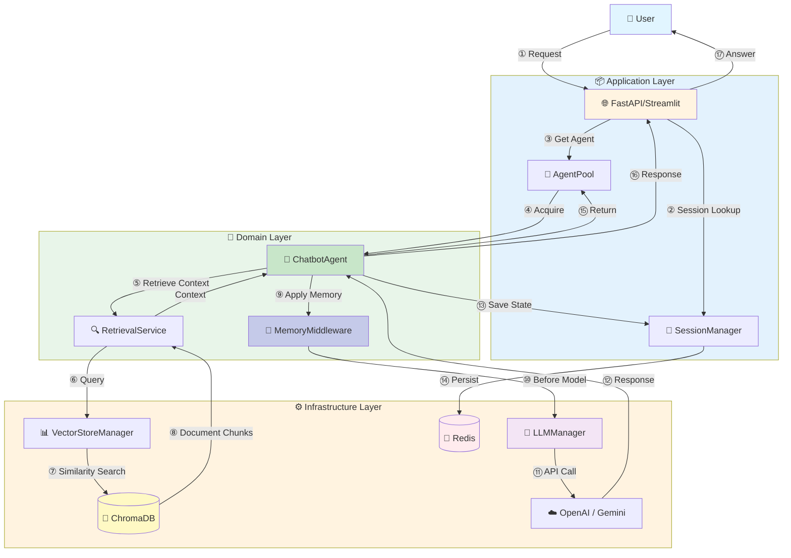

# Architecture Guide

This document describes the system architecture, layer responsibilities, and design principles of the RAG Chatbot application.

## Architecture Overview

The project follows **Clean Architecture** principles with clear separation of concerns. The diagram below maps the conceptual RAG flow directly to our codebase structure:



### Key Components mapped to Code

#### 1. The Application Layer (`src/application`)
*   **`AgentPool`**: Instead of instantiating a new heavy `HRChatbot` object for every request, this component manages a fixed pool of initialized agents. It handles the "check-out/check-in" lifecycle, drastically reducing overhead.

#### 2. The Domain Layer (`src/domain`)
This is where the business logic lives, independent of the database or UI.
*   **`ChatbotAgent`**: The base class for all bots. It defines the standard execution flow: `Retrieve -> Plan -> Generate`.
*   **`MemoryMiddlewareFactory`**: Creates LangChain middleware for memory management (trim/summarize strategies). Memory operations are applied automatically via `@before_model` decorators before each model call.
*   **`RetrievalService`**: It doesn't know *how* `ChromaDB` works; it just asks for "relevant documents". This abstraction allows us to swap vector stores later.

#### 3. The Infrastructure Layer (`src/infrastructure`)
*   **`VectorStoreManager`**: Handles the gritty details of embedding generation and ChromaDB connection.
*   **`LLMManager`**: A unified interface for all providers. Whether you use `gpt-4` or `gemini-1.5`, the domain layer just calls `llm.generate()`.

### High-Level Architecture

The project follows **Clean Architecture** principles with clear separation of concerns:

```
┌─────────────────────────────────────────────────────────────────┐
│                         Presentation Layer                      │
├─────────────────────────────────────────────────────────────────┤
│  ┌──────────────┐                    ┌──────────────┐          │
│  │   FastAPI    │                    │  Streamlit   │          │
│  │   (REST API) │                    │     (UI)     │          │
│  └──────┬───────┘                    └──────┬───────┘          │
└─────────┼────────────────────────────────────┼──────────────────┘
          │                                    │
          └────────────────┬───────────────────┘
                           │
┌──────────────────────────┼──────────────────────────────────────┐
│                   Application Layer                             │
├──────────────────────────┼──────────────────────────────────────┤
│  ┌───────────────────────▼───────────────────────┐             │
│  │         Chatbot Use Cases                      │             │
│  │  - Agent Pool Management                       │             │
│  │  - Graph Factory                               │             │
│  └───────────────────────┬───────────────────────┘             │
│                          │                                       │
│  ┌───────────────────────▼───────────────────────┐             │
│  │         Ingestion Use Cases                    │             │
│  │  - Document Loading                            │             │
│  │  - Document Chunking                           │             │
│  │  - Embedding Generation                        │             │
│  └────────────────────────────────────────────────┘             │
└──────────────────────────┬──────────────────────────────────────┘
                           │
┌──────────────────────────┼──────────────────────────────────────┐
│                      Domain Layer                                │
├──────────────────────────┼──────────────────────────────────────┤
│  ┌───────────────────────▼───────────────────────┐             │
│  │              Chatbot Domain                     │             │
│  │  ┌─────────────────────────────────────────┐  │             │
│  │  │  ChatbotAgent (Base Class)              │  │             │
│  │  │  - HRChatbot (Implementation)            │  │             │
│  │  │  - ConfigManager                         │  │             │
│  │  │  - ToolFactory                           │  │             │
│  │  │  - PromptBuilder                          │  │             │
│  │  └─────────────────────────────────────────┘  │             │
│  └────────────────────────────────────────────────┘             │
│  ┌────────────────────────────────────────────────┐             │
│  │         Memory Domain                         │             │
│  │  - MemoryMiddlewareFactory                     │             │
│  │  - MemoryConfig                                │             │
│  └────────────────────────────────────────────────┘             │
│  ┌────────────────────────────────────────────────┐             │
│  │         Retrieval Domain                      │             │
│  │  - RetrievalService                            │             │
│  └────────────────────────────────────────────────┘             │
│  ┌────────────────────────────────────────────────┐             │
│  │         Session Domain                        │             │
│  │  - ChatbotSession                              │             │
│  │  - ChatbotSessionManager                       │             │
│  └────────────────────────────────────────────────┘             │
└──────────────────────────┬──────────────────────────────────────┘
                           │
┌──────────────────────────┼──────────────────────────────────────┐
│                  Infrastructure Layer                            │
├──────────────────────────┼──────────────────────────────────────┤
│  ┌───────────────────────▼───────────────────────┐             │
│  │              LLM Providers                     │             │
│  │  - OpenAI, Anthropic, Google, Ollama          │             │
│  └────────────────────────────────────────────────┘             │
│  ┌────────────────────────────────────────────────┐             │
│  │           Vector Store                         │             │
│  │  - ChromaDB Manager                            │             │
│  │  - Embedding Providers                         │             │
│  └────────────────────────────────────────────────┘             │
│  ┌────────────────────────────────────────────────┐             │
│  │              Storage                           │             │
│  │  - Redis Checkpointing                         │             │
│  │  - File Storage                                │             │
│  └────────────────────────────────────────────────┘             │
└──────────────────────────────────────────────────────────────────┘
```

## Layer Responsibilities

### Domain Layer (`src/domain/`)

**Purpose**: Core business logic, entities, and domain models. No dependencies on external frameworks.

**Components**:
- **Chatbot Domain** (`chatbot/`): Chatbot agents, configuration, tools, prompts
- **Memory Domain** (`memory/`): Memory management strategies
- **Retrieval Domain** (`retrieval/`): Document retrieval service
- **Session Domain** (`session/`): Session management

**Key Classes**:
- `ChatbotAgent`: Base class for all chatbots
- `HRChatbot`: HR-specific chatbot implementation
- `MemoryMiddlewareFactory`: Creates memory management middleware for LangChain agents
- `RetrievalService`: Handles document retrieval
- `ChatbotSession`: Represents a user session

### Application Layer (`src/application/`)

**Purpose**: Use cases and orchestration logic. Coordinates domain objects.

**Components**:
- **Chatbot Use Cases** (`chatbot/`): Agent pool management, graph factory
- **Ingestion Use Cases** (`ingestion/`): Document loading, chunking, embedding

**Key Classes**:
- `AgentPool`: Manages shared agent instances
- `DocumentLoader`: Loads documents from various sources
- `DocumentChunker`: Splits documents into chunks
- `Embedder`: Generates embeddings for documents

### Infrastructure Layer (`src/infrastructure/`)

**Purpose**: External services and implementations.

**Components**:
- **LLM** (`llm/`): LLM provider integrations (OpenAI, Anthropic, Google, Ollama)
- **Vector Store** (`vectorstore/`): ChromaDB and embedding providers
- **Storage** (`storage/`): Redis checkpointing, file storage

**Key Classes**:
- `LLMManager`: Manages LLM instances
- `VectorStoreManager`: Manages vector store instances
- `Checkpointer`: Handles Redis checkpointing

### API Layer (`src/api/`)

**Purpose**: FastAPI routes and middleware.

**Components**:
- **Middleware** (`middleware/`): Rate limiting, CORS, etc.
- **Routes** (`v1/routes/`): API endpoints

**Key Files**:
- `chat.py`: Chat endpoints
- `rate_limiter.py`: Rate limiting middleware

### UI Layer (`src/ui/`)

**Purpose**: Streamlit application for testing and demonstration.

**Components**:
- **Pages** (`pages/`): Streamlit pages (chatbot, dashboard, API explorer)

### Shared (`src/shared/`)

**Purpose**: Common utilities and configuration.

**Components**:
- **Config** (`config/`): Application settings, logging
- **Dependencies** (`dependencies/`): Dependency injection
- **Memory** (`memory/`): Memory configuration
- **Utils** (`utils/`): Token counting, token counter utilities

## Project Structure

```
rag_chatbot/
├── src/
│   ├── main.py                   # Application entry point
│   ├── domain/                   # Domain layer
│   │   ├── chatbot/
│   │   │   ├── core/            # Core chatbot framework
│   │   │   │   ├── chatbot_agent.py
│   │   │   │   ├── config.py
│   │   │   │   ├── prompts.py
│   │   │   │   ├── tools.py
│   │   │   │   └── memory_middleware.py
│   │   │   └── hr_chatbot.py
│   │   ├── memory/                  # Memory configuration (no longer used)
│   │   ├── retrieval/
│   │   └── session/
│   ├── application/              # Application layer
│   │   ├── chatbot/
│   │   └── ingestion/
│   ├── infrastructure/           # Infrastructure layer
│   │   ├── llm/
│   │   ├── vectorstore/
│   │   └── storage/
│   ├── api/                      # API layer
│   │   ├── middleware/
│   │   └── v1/
│   ├── ui/                       # UI layer
│   │   └── pages/
│   └── shared/                  # Shared utilities
│       ├── config/
│       ├── memory/
│       ├── utils/               # Token counting, token counter
│       └── dependencies/
├── scripts/                      # Scripts and tools
├── config/                       # Configuration files
├── data/                         # Data directories
└── docs/                         # Documentation
```

## Design Principles

### Clean Architecture

- **Dependency Rule**: Dependencies point inward. Outer layers depend on inner layers, not vice versa.
- **Independence**: Business logic is independent of frameworks, UI, and databases.
- **Testability**: Business logic can be tested without external dependencies.

### SOLID Principles

- **Single Responsibility**: Each class has one reason to change
- **Open/Closed**: Open for extension, closed for modification
- **Liskov Substitution**: Subclasses can replace base classes
- **Interface Segregation**: Clients shouldn't depend on unused interfaces
- **Dependency Inversion**: Depend on abstractions, not concretions

### Key Patterns

- **Dependency Injection**: Dependencies are injected, not created internally
- **Factory Pattern**: Agent pool uses factory pattern for agent creation
- **Strategy Pattern**: Memory management uses strategy pattern (via LangChain middleware)
- **Middleware Pattern**: Memory operations use LangChain's @before_model middleware decorators
- **Repository Pattern**: Vector store abstraction follows repository pattern
- **Observer Pattern**: Token counting uses observer pattern for monitoring

### Token Counting

Token counting is implemented as an optional feature using the observer pattern:

- **TokenCountingObserver**: Observes chat events and accumulates token counts
- **TokenCountingWrapper**: Manages observer lifecycle and configuration
- **Utility Functions**: Modular functions for collecting and processing token data

Token counting is integrated into the `ChatbotAgent.chat()` method and can be enabled/disabled via configuration. When enabled, it automatically tracks token usage for all components (query, system prompt, history, context, response) and provides detailed breakdowns with cost estimates.

See [Token Counting Guide](TOKEN_COUNTING.md) for detailed documentation.

## Data Flow

### The RAG Data Flow

1. **Session Lookup**: `SessionManager` retrieves the conversation history from Redis.
2. **Agent Allocation**: `AgentPool` provides a warm `ChatbotAgent`.
3. **Retrieval**: `ChatbotAgent` calls `RetrievalService` → `VectorStoreManager` → `ChromaDB` to get relevant policy chunks.
4. **Memory Middleware**: Before model call, `MemoryMiddlewareFactory` middleware applies memory strategies (trim/summarize) to manage conversation history automatically.
5. **Prompt Construction**: The agent combines the **System Prompt** (from config), **Processed Conversation History** (after memory middleware), and **Retrieved Context** into a single payload.
6. **Generation**: `LLMManager` sends the payload to the external provider.
7. **Teardown**: The response is saved to Redis checkpoint, and the agent is scrubbed and returned to the pool.

### Detailed Request Flow

1. **Request** → FastAPI endpoint
2. **Session** → Session manager retrieves/creates session
3. **Agent** → Agent pool provides chatbot instance
4. **Token Counting** → Collects token data (if enabled)
5. **Query** → Chatbot processes query
6. **Retrieval** → Retrieval service searches vector store
7. **LLM** → LLM generates response with context
8. **Token Counting** → Processes and logs token counts (if enabled)
9. **Memory Middleware** → Memory strategies (trim/summarize) applied via LangChain middleware before model call
10. **Memory** → Conversation saved to Redis checkpoint
11. **Response** → Formatted response returned to user

See [HR Chatbot Flow](HR_CHATBOT_FLOW.md) for detailed sequence diagram.

## Extension Points

### Creating New Chatbots

1. Create YAML config file in `config/chatbot/`
2. Create prompts file in `config/chatbot/prompts/`
3. Subclass `ChatbotAgent` with minimal implementation
4. Create vector store using ingestion scripts

See [Creating a New Chatbot](CREATING_NEW_CHATBOT.md) for detailed guide.

### Adding New LLM Providers

1. Extend `LLMManager` to support new provider
2. Add provider-specific configuration
3. Update environment variables

### Adding New Vector Stores

1. Implement vector store interface
2. Update `VectorStoreManager`
3. Add configuration options

## Performance Considerations

### Memory Efficiency

- **Shared Agent Pool**: Reduces memory usage by ~99% (from 2GB per user to 20MB shared pool)
- **Lazy Loading**: Vector stores loaded on demand
- **Caching**: Configuration and vector stores are cached

### Performance Metrics

Here are the concrete numbers from our production deployment:

| Metric | Value |
|--------|-------|
| **Memory Usage** | 99% reduction (from 2GB per user to 20MB shared pool) |
| **Response Time** | 2-3 seconds average (including retrieval + generation) |
| **Correctness** | 78% (LLM-as-Judge scoring) |
| **Groundedness** | 100% (all responses based on retrieved documents) |
| **Relevance** | 97% (answers directly address user questions) |
| **Retrieval Relevance** | 95% (retrieved documents are highly relevant) |
| **Scannability** | 78% (structured, easy-to-scan responses) |
| **Concurrent Users** | Tested up to 1,000+ with single agent pool |
| **Cost per Query** | ~$0.01 (using Gemini Flash + OpenAI embeddings) |
| **Uptime** | 99.9% (Redis checkpoints survive server restarts) |

### Session Persistence

- **Redis Checkpointing**: Fast session persistence that survives server restarts
- **Automatic Recovery**: Conversations are automatically restored after server restart

## Security

- **Rate Limiting**: API endpoints have rate limiting
- **Input Validation**: Pydantic models validate all inputs
- **Session Isolation**: Each session is isolated
- **API Key Management**: Keys stored in environment variables

## Related Documentation

- [HR Chatbot Flow](HR_CHATBOT_FLOW.md) - Request processing flow
- [Creating a New Chatbot](CREATING_NEW_CHATBOT.md) - Extension guide
- [Configuration Guide](CONFIGURATION.md) - Configuration details
- [Session Management](SESSION_MANAGEMENT.md) - Session architecture
- [Token Counting Guide](TOKEN_COUNTING.md) - Token counting and monitoring

