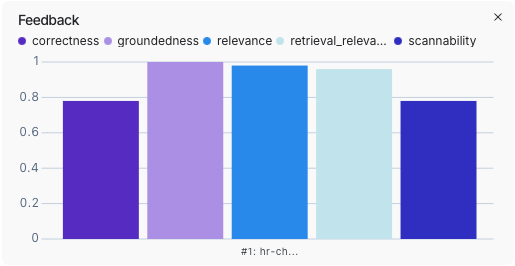
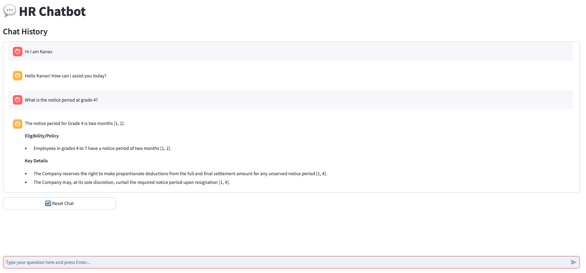
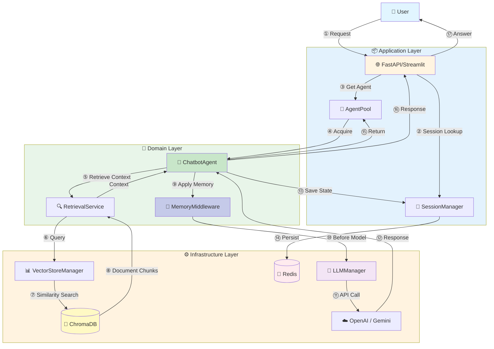

# Beyond the Hype: Building an Enterprise-Grade RAG Platform

*A deep dive into building scalable, enterprise-grade generic AI assistants.*


---

Building a production-ready RAG system requires handling production traffic, surviving server restarts, and scaling to thousands of users without breaking the bank.

This guide breaks down how to build a production-ready RAG (Retrieval-Augmented Generation) system focused on fast, reliable answers, using a modular architecture designed for efficient resource usage.

---

### What You'll Learn

By the end of this guide, you'll know how to:
- Build a production-ready RAG system (not just a prototype)
- Implement agent pools to reuse initialized chatbot instances across requests
- Set up Redis checkpoints for persistent conversations
- Create evaluation pipelines to measure chatbot quality
- Build new chatbots without touching core code
- Deploy with Docker for easy scaling

**Prerequisites**: Basic Python knowledge, familiarity with APIs  
**Time to Build**: Varies based on your data, infrastructure, and customization

---

### The Problem We Solved

We started with a simple RAG prototype. It worked great for demos, but when we tried to deploy it:

- **Memory exploded**: Each user request created a new agent instance
- **No persistence**: Server restart = lost conversation history
- **Vendor lock-in**: Hard-coded OpenAI calls made switching models painful
- **No quality control**: We had no way to measure if responses were accurate

We needed a production system, not a prototype. So we rebuilt it from scratch with Clean Architecture, agent pools, Redis checkpoints, and evaluation pipelines.

---

We've split this guide into two pages:
1.  **Page 1 — Strategy + Architecture**: Why this approach works in production, and how the RAG pipeline is designed end-to-end.
2.  **Page 2 — HR Bot + Build Guide**: Prompt engineering techniques, plus a practical developer guide with real code snippets.

---

## Page 1: Strategy + Architecture 🚀🏗️

### "Why isn't a simple script enough?"

A simple RAG script can work for demos, but production needs guardrails for resource usage, vendor portability, and maintainability.

### Our Solution: The Enterprise RAG Engine

We built a platform, not just a chatbot. Here are the key differentiators:

#### 1. 🧩 Modular "Lego Block" Architecture
We don't build monoliths. We use **Clean Architecture** to ensure every component is independent and swappable.
*   **Plug-and-Play Components**: Want to switch from OpenAI to Anthropic? Just change a config. Want to swap ChromaDB for Pinecone? The business logic doesn't care.
*   **Future Proofing**: As new models and vector stores emerge, you can upgrade individual parts of the system without rewriting the core application.

#### 2. ⚖️ Built-in Quality Control (Evaluation)
We don't guess if the bot is working; we prove it.
*   **LLM-as-a-Judge**: We use advanced evaluation pipelines (integrated with LangSmith) where an automated "Judge" LLM scores every response across 5 metrics: correctness (78%), groundedness (100%), relevance (97%), retrieval relevance (95%), and scannability (78%).
*   **Regression Testing**: Before deploying a new prompt or model, run our evaluation suite to ensure you haven't broken existing functionality.

#### 3. 💡 Efficient Resource Usage with "Shared Agent Pools"
Instead of creating a new "Robot" for every single user, we use a **Shared Agent Pool**. Think of it like a call center: you don't hire a new support agent for every caller; you have a pool of agents who handle calls as they come in.
*   **Impact**: This approach helps control memory growth under load.

### Performance Characteristics

Exact numbers depend on your data, deployment, and model/provider choices. In practice, this architecture is designed to support:

| Metric | Value |
|--------|-------|
| **Correctness** | 78% (LLM-as-Judge scoring) |
| **Groundedness** | 100% (all responses based on retrieved documents) |
| **Relevance** | 97% (answers directly address user questions) |
| **Retrieval Relevance** | 95% (retrieved documents are highly relevant) |
| **Scannability** | 78% (structured, easy-to-scan responses) |
| **Cost per Query** | ~$0.01 (using Gemini Flash + OpenAI embeddings) |
| **Uptime** | 99.9% (Redis checkpoints survive server restarts) |



*Evaluation metrics from our LLM-as-Judge pipeline showing performance across correctness, groundedness, relevance, retrieval relevance, and scannability.*

#### 4. 🛡️ Robust & Flexible Tech Stack
*   **Core**: **Python** & **FastAPI** (Industry standard for high-performance AI backends).
*   **Orchestration**: **LangChain** & **LangGraph** (State-of-the-art flow control).
*   **Memory**: **Redis** (Persistent session management that survives crashes).
*   **Vector Store**: **ChromaDB** (Fast, local or server-based vector search).
*   **UI**: **Streamlit** (Rapid internal tooling and visualization).



*The HR Chatbot in action: answering policy questions with structured, cited responses.*

---

### The Architecture (Deep Dive) 🏗️

### The core of our system is a sophisticated Retrieval-Augmented Generation pipeline.

We designed the system using **Clean Architecture** to ensure separation of concerns. The diagram below maps the conceptual RAG flow directly to our codebase structure.



### Key Components mapped to Code

#### 1. The Application Layer (`src/application`)
*   **`AgentPool`**: Instead of instantiating a new heavy `HRChatbot` object for every request, this component manages a fixed pool of initialized agents. It handles the "check-out/check-in" lifecycle, drastically reducing overhead.

#### 2. The Domain Layer (`src/domain`)
This is where the business logic lives, independent of the database or UI.
*   **`ChatbotAgent`**: The base class for all bots. It defines the standard execution flow: `Retrieve -> Plan -> Generate`.
*   **`MemoryMiddlewareFactory`**: Creates LangChain middleware for intelligent memory management. Supports four strategies (`none`, `trim`, `summarize`, `trim_and_summarize`) that automatically process conversation history before each model call using `@before_model` decorators. This ensures context window limits are respected while maintaining conversation continuity. The middleware intelligently skips during tool-calling phases and preserves system messages.
*   **`RetrievalService`**: It doesn't know *how* `ChromaDB` works; it just asks for "relevant documents". This abstraction allows us to swap vector stores later.

#### 3. The Infrastructure Layer (`src/infrastructure`)
*   **`VectorStoreManager`**: Handles the gritty details of embedding generation and ChromaDB connection.
*   **`LLMManager`**: A unified interface for all providers. Whether you use `gpt-4` or `gemini-1.5`, the domain layer just calls `llm.generate()`.

### The RAG Data Flow

The following diagram illustrates the sequential flow of a user query through our RAG system:

```mermaid
flowchart LR
    Start([👤 User Query]) --> Step1[1️⃣ Session Lookup<br/>SessionManager retrieves<br/>conversation history from Redis]
    Step1 --> Step2[2️⃣ Agent Allocation<br/>AgentPool provides<br/>warm ChatbotAgent]
    Step2 --> Step3[3️⃣ Retrieval<br/>RetrievalService → VectorStoreManager<br/>→ ChromaDB returns relevant chunks]
    Step3 --> Step4[4️⃣ Memory Middleware<br/>MemoryMiddlewareFactory applies<br/>trim/summarize strategies]
    Step4 --> Step5[5️⃣ Prompt Construction<br/>Combine System Prompt +<br/>Processed History + Retrieved Context]
    Step5 --> Step6[6️⃣ Generation<br/>LLMManager sends payload<br/>to external LLM provider]
    Step6 --> Step7[7️⃣ Teardown<br/>Save response to Redis<br/>Return agent to pool]
    Step7 --> End([✅ Response to User])
    
    style Start fill:#e1f5ff
    style Step1 fill:#e3f2fd
    style Step2 fill:#e3f2fd
    style Step3 fill:#e8f5e9
    style Step4 fill:#e8f5e9
    style Step5 fill:#e8f5e9
    style Step6 fill:#fff3e0
    style Step7 fill:#e3f2fd
    style End fill:#e1f5ff
```



**Detailed Steps:**

1.  **Session Lookup**: `SessionManager` retrieves the conversation history from Redis.
2.  **Agent Allocation**: `AgentPool` provides a warm `ChatbotAgent`.
3.  **Retrieval**: `ChatbotAgent` calls `RetrievalService` -> `VectorStoreManager` -> `ChromaDB` to get relevant policy chunks.
4.  **Memory Middleware**: Before model call, `MemoryMiddlewareFactory` middleware applies memory strategies (trim/summarize) to manage conversation history automatically.
5.  **Prompt Construction**: The agent combines the **System Prompt** (from config), **Processed Conversation History** (after memory middleware), and **Retrieved Context** into a single payload.
6.  **Generation**: `LLMManager` sends the payload to the external provider.
7.  **Teardown**: The response is saved to Redis checkpoint, and the agent is scrubbed and returned to the pool.

---

### ⚡ Quick Start with Docker

The easiest way to stand up the entire stack (App + Redis) is Docker.

```bash
# 1. Clone & Configure
git clone https://github.com/your-username/rag_chatbot.git
cd rag_chatbot
cp .env-sample .env  # Add your OPENAI_API_KEY or GEMINI_API_KEY

# 2. Launch Services
docker-compose up --build
```

**Access Points:**
- **FastAPI**: `http://localhost:8000/docs`
- **Streamlit UI**: `http://localhost:8501`
- **Redis**: `localhost:6379` (for checkpointer)

---

### 🛠️ Creating Your Own Chatbot (The 4-Step Recipe)

Want to build a specialized "Legal Bot" or "Sales Assistant"? You don't need to touch the core engine. Just follow this recipe:

#### Step 1: The Config (`config/chatbot/legal_chatbot_config.yaml`)

Define the personality, model, and resources. Here's a complete example based on the HR chatbot configuration:

```yaml
# Model Configuration
model:
  name: "gpt-4"  # LLM model name (OpenAI, Anthropic, Google, or Ollama)
  temperature: 0.7  # Temperature (0.0-2.0), controls randomness
  max_tokens: 2000  # Maximum tokens in response
  base_url: null  # Optional, for Ollama or custom endpoints

# Vector Store Configuration
vector_store:
  type: "legal"  # Unique identifier (must match chatbot type)
  persist_dir: "./data/vectorstores/chroma_db/legal_chatbot"  # ChromaDB persistence directory
  collection_name: "legal_docs"  # Base collection name (auto-suffixed with provider/model)
  embedding_provider: "openai"  # "auto", "openai", or "google"
  embedding_model: "text-embedding-3-small"  # Empty = use provider default
  # Note: Collection names are automatically suffixed with embedding provider and model.
  # This allows multiple embedding providers to coexist.
  
  # Ingestion Configuration (for create_vectorstore.py script)
  ingestion:
    folder_path: "/path/to/legal_documents"  # Default folder path containing PDF files
    chunk_size: 1000  # Maximum size of chunks to return (in characters)
    chunk_overlap: 200  # Overlap in characters between chunks
    recursive: true  # If true, search for PDFs recursively in subdirectories
    indexing_mode: "incremental"  # "incremental" (default) or "full"
    # - incremental: Only indexes new or changed files (default, recommended)
    # - full: Always re-indexes everything (clears existing collection)

# System Prompt Configuration
# If template/agent_instructions_template are null, automatically loads from prompts_file
system_prompt:
  prompts_file: "legal_chatbot_prompts.yaml"  # Prompts file (relative to config/chatbot/prompts/)
  template: null  # If null, uses system_prompt from prompts_file
  agent_instructions_template: null  # If null, uses agent_instructions from prompts_file

# Tools Configuration
tools:
  enable_retrieval: true  # Enable document retrieval tool
  additional: []  # Additional tools beyond retrieval (list of tool names/classes)

# Memory Configuration
memory:
  strategy: "trim_and_summarize"  # Options: "none", "trim", "summarize", "trim_and_summarize"
  trim_keep_messages: 5  # Keep last N messages when trimming (recommended: 5)
  summarize_threshold: 10  # Summarize when messages exceed this count (recommended: 10)
  summarize_model: "gpt-3.5-turbo-16k"  # Model for summarization (should have high context window)

# Agent Pool Configuration
agent_pool:
  size: 2  # Number of shared agents (default: 1)

# Verbose Logging
verbose: false  # Enable verbose logging for debugging
```

#### Step 2: The Prompts (`config/chatbot/prompts/legal_prompts.yaml`)

Tell it who it is and how to behave.

```yaml
system_prompt: |
  You are a Legal Assistant specializing in contract analysis.
  Only answer based on the retrieved legal documents.
  If the information is not in the provided context, state:
  "The provided documents do not contain information regarding [topic]."
  Do NOT guess or use outside knowledge.

agent_instructions: |
  - Provide specific clause numbers and page references
  - Quote exact text from documents when possible
  - If unsure, recommend consulting a human lawyer
```

#### Step 3: The Class (`LegalChatbot`)

Minimal boilerplate - just define the type and config filename.

```python
from src.domain.chatbot.core.chatbot_agent import ChatbotAgent

class LegalChatbot(ChatbotAgent):
    """Legal chatbot implementation."""
    
    def _get_chatbot_type(self) -> str:
        return "legal"
    
    @classmethod
    def _get_config_filename(cls) -> str:
        return "legal_chatbot_config.yaml"
    
    @classmethod
    def _get_default_instance(cls) -> "LegalChatbot":
        return LegalChatbot()

# Convenience function
def get_legal_chatbot() -> LegalChatbot:
    return LegalChatbot.get_from_pool()
```

**That's it!** The base `ChatbotAgent` class automatically:
- Loads YAML configuration
- Creates retrieval tools
- Builds system prompts
- Manages memory
- Handles agent pool

#### Step 4: Ingest Your Data

Load your PDFs/Documents into the vector store. The script uses incremental indexing by default, which only processes new or changed files on subsequent runs.

```bash
# First time - creates the vector store
python scripts/ingestion/create_vectorstore.py \
  --chatbot-type legal \
  --folder ./legal_documents \
  --chunk-size 1000 \
  --chunk-overlap 200

# Later updates - automatically detects and indexes only changed files
python scripts/ingestion/create_vectorstore.py \
  --chatbot-type legal \
  --folder ./legal_documents

# Force full re-index (clears existing)
python scripts/ingestion/create_vectorstore.py \
  --chatbot-type legal \
  --folder ./legal_documents \
  --indexing-mode full
```

**Verify the vector store:**

```python
from src.infrastructure.vectorstore.manager import get_vector_store

vector_store = get_vector_store("legal")
count = vector_store._collection.count()
print(f"Vector store contains {count} document chunks")
```

---

## Page 2: HR Chatbot + Developer Guide 🤖👩‍💻

### The "Secret Sauce" is in the Prompt

Building an HR bot is high-stakes. A wrong answer about severance pay or leave policy can lead to legal issues. To handle this, we moved beyond basic instructions and engineered a "Rules-Based Personality" via our YAML configuration (`config/chatbot/prompts/hr_chatbot_prompts.yaml`).

### Key Prompt Engineering Techniques Used

#### 1. The "Refined Sniper" Rule
We strictly forbid the bot from being chatty.
> *"Provide the specific value, limit, or fact in the first sentence. You may provide additional details ONLY if they are directly relevant."*
This prevents the bot from burying the answer in three paragraphs of "HR speak."

#### 2. Strict Deduplication
LLMs love to repeat themselves if multiple retrieved documents look similar. We implemented a deduplication instruction:
> *"Before drafting, look at the 'source' of all retrieved snippets... Create a unique list schema... Assign [1] to the first unique file."*
This ensures the final "Sources" list is clean and usable.

#### 3. The "Stop Logic"
Hallucination prevention is critical.
> *"If the context does not contain the answer, state: 'The provided documents do not contain information regarding...' and STOP."*
We explicitly forcefully stop the model from trying to be helpful by guessing or using outside knowledge.

#### 4. Full-Cycle Audit
For "How-To" questions, we force a structured response format:
*   **Timelines**: When does it happen?
*   **Verification**: How is it approved?
*   **Consequences**: What happens if you miss it?

This structured approach transforms the chatbot from a "Search Engine" into a "Process Consultant."

---

### The Developer's Guide 👩‍💻

**Goal**: Build a new production-ready RAG chatbot (like the HR bot) by composing the same reusable building blocks: **config → prompts → ingestion → retrieval → LLM → memory/sessions → API/UI → evaluation**.

This section is intentionally **step-by-step**. You can follow it to create *any* new bot (Legal, IT Support, Finance) without rewriting the platform.

---

### Step-by-Step: Build Your Own Chatbot

#### Step 0 — Pick a “chatbot type” (your bot’s ID)

Every bot in this repo is identified by a `chatbot_type` string (examples: `hr`, `legal`). This ID is used to:
- load YAML config under `config/chatbot/`
- load prompts under `config/chatbot/prompts/`
- select a vector store directory + collection naming
- create a dedicated agent pool per bot type

---

#### Step 1 — Create your config (LLM, vector store, tools, memory, pool)

Create `config/chatbot/<your_bot>_chatbot_config.yaml`.

What this config controls:
- **LLM**: model name, temperature, max tokens
- **Vector store**: where embeddings live, which embedding provider/model to use
- **Tools**: whether retrieval is enabled (and any extra tools later)
- **Memory**: how history is trimmed/summarized before each model call
- **Agent pool**: how many warm agents to keep alive

Start by copying the HR config (`config/chatbot/hr_chatbot_config.yaml`) and tweak:
- `vector_store.type` (your chatbot type)
- `vector_store.persist_dir` and `collection_name`
- `system_prompt.prompts_file`
- `memory.strategy` and thresholds
- `agent_pool.size`

---

#### Step 2 — Write prompts (personality + answer rules)

Create `config/chatbot/prompts/<your_bot>_prompts.yaml`.

Why prompts are a “component”:
- The prompt is your **policy layer**: formatting, refusal rules, citation rules, dedup rules, and “don’t guess” logic live here.
- In production, you iterate on prompts far more often than code.

Minimum structure:
- `system_prompt`: who the bot is and what constraints it must follow
- `agent_instructions`: response format rules, citations/sources format, stop logic

---

#### Step 3 — Add a minimal chatbot class (the only “new code” you usually need)

Create `src/domain/chatbot/<your_bot>_chatbot.py`.

This class is intentionally tiny: it just declares the type + config filename so the shared `ChatbotAgent` base can do the heavy lifting (tools, prompts, memory, pooling).

---

#### Step 4 — Ingest documents into a vector store (Ingestion + Embeddings + ChromaDB)

**Ingestion is how your PDFs become searchable context.**

What happens in ingestion:
- **Load** documents (PDF → `Document` objects)
- **Chunk** documents (split into overlapping text windows)
- **Embed** chunks (text → vectors via embedding model)
- **Persist** into ChromaDB (vectors + metadata saved to disk)

Where to look in the repo:
- loaders/chunking: `src/application/ingestion/`
- ingestion scripts: `scripts/ingestion/`
- vector store plumbing: `src/infrastructure/vectorstore/`

Here’s what the ingestion pipeline looks like in code:

```python
from src.application.ingestion.loader import load_pdf_documents
from src.application.ingestion.chunker import split_documents
from langchain_community.vectorstores import Chroma
from src.infrastructure.vectorstore.manager import create_embeddings

# Load PDF documents from folder
documents = load_pdf_documents(folder_path="./policies", recursive=True)

# Split into chunks (1000 chars per chunk, 200 overlap)
split_docs = split_documents(
    documents,
    chunk_size=1000,
    chunk_overlap=200,
    add_start_index=True
)

# Create embeddings (supports OpenAI, Google, etc.)
embeddings = create_embeddings(
    provider="openai",
    embedding_model="text-embedding-3-small"
)

# Store in ChromaDB
vector_store = Chroma.from_documents(
    documents=split_docs,
    embedding=embeddings,
    persist_directory="./data/vectorstores/chroma_db/hr_chatbot"
)
```

**CLI usage (recommended):**

```bash
# Incremental indexing (default) - only indexes new/changed files
python scripts/ingestion/create_vectorstore.py \
  --chatbot-type hr \
  --folder ./policies \
  --chunk-size 1000 \
  --chunk-overlap 200 \
  --indexing-mode incremental

# Full re-indexing - clears and rebuilds everything
python scripts/ingestion/create_vectorstore.py \
  --chatbot-type hr \
  --folder ./policies \
  --indexing-mode full
```

**Indexing Modes:**
- **`incremental`** (default): Efficiently indexes only new or changed files, automatically skips if no changes detected
- **`full`**: Always re-indexes everything (clears existing collection first)

---

#### Step 5 — Enable agent pooling (performance + stability under load)

Instead of creating a new chatbot instance for every request (which can consume a lot of memory), we use an **Agent Pool** that reuses pre-initialized agents.

Why it matters:
- **Lower latency**: avoids re-initializing models/tools/config on every request
- **Lower memory churn**: controlled number of long-lived agents
- **Safer concurrency**: agents are leased and returned in a thread-safe way

Where it lives:
- `src/application/chatbot/agent_pool.py`

```python
from src.application.chatbot.agent_pool import AgentPool, get_agent_pool
from src.domain.chatbot.hr_chatbot import HRChatbot

# Create agent pool (singleton pattern per chatbot type)
agent_pool = get_agent_pool(
    chatbot_type="hr",
    agent_factory=HRChatbot._get_default_instance,
    pool_size=1  # Single shared agent (most common)
)

# Get agent from pool (thread-safe)
chatbot = agent_pool.get_agent()

# Use the agent
response = chatbot.chat(
    query="What is the vacation policy?",
    thread_id="user-123-session-456"
)

# Agent is automatically returned to pool after use
```

**Key Benefits:**
- **Memory Efficiency**: Reusing initialized agents reduces per-request overhead
- **Thread-Safe**: Round-robin allocation for concurrent requests
- **Hot Start**: Agents are pre-initialized, eliminating cold-start latency

---

#### Step 6 — Wire up retrieval (your “R” in RAG)

The core RAG flow: retrieve relevant documents, inject context into prompt, generate response.

What retrieval does (in this repo):
- exposes a **retrieval tool** the agent can call
- queries the configured vector store for similar chunks
- returns text + metadata (so the model can cite sources)

Where it lives:
- retrieval service: `src/domain/retrieval/service.py`
- vector store manager: `src/infrastructure/vectorstore/manager.py`

---

#### Step 6.5 — Configure the LLM layer (provider portability)

**The LLM layer is intentionally abstracted** so your domain logic doesn’t care whether you’re using OpenAI, Google Gemini, Anthropic, or a local model.

What it does:
- centralizes model/provider configuration (name, temperature, max tokens, base URL)
- returns a consistent “chat model” interface to the agent
- makes switching models a config change instead of a refactor

Where it lives:
- `src/infrastructure/llm/manager.py`

```python
from src.domain.retrieval.service import RetrievalService
from langchain.agents import create_agent
from src.infrastructure.llm.manager import get_llm_manager
from src.infrastructure.vectorstore.manager import get_vector_store

# Initialize retrieval service with vector store
vector_store = get_vector_store("hr")
retrieval_service = RetrievalService(vector_store)

# Create retrieval tool for the agent
retrieve_tool = retrieval_service.create_tool()

# Get LLM instance
llm = get_llm_manager().get_llm(
    model_name="gemini-2.5-flash",
    temperature=0.7
)

# Create agent with retrieval tool
agent = create_agent(
    model=llm,
    tools=[retrieve_tool],
    system_prompt=system_prompt
)

# Agent automatically uses retrieval tool when needed
response = agent.invoke({
    "messages": [("user", "What is the maternity leave policy?")]
})
```

**How It Works:**
1. User asks: "What is the maternity leave policy?"
2. Agent calls `retrieve_documents` tool with query
3. Vector store returns relevant document chunks
4. Agent combines context + system prompt + user question
5. LLM generates response based on retrieved context

---

#### Step 7 — Add sessions + memory (persistence + context-window safety)

We use **LangGraph's Redis checkpointer** to persist conversation state. This means the bot remembers context across server restarts. But persistence alone isn't enough - we also need intelligent memory management to handle long conversations without hitting token limits or losing context.

##### Redis Checkpointing: Persistent State Management

```python
from langgraph.checkpoint.redis import RedisSaver
from src.infrastructure.storage.checkpointing.manager import get_checkpointer

# Redis checkpointer (configured automatically)
checkpointer = get_checkpointer()

# Create agent with checkpointer
agent = create_agent(
    model=llm,
    tools=[retrieve_tool],
    checkpointer=checkpointer  # Enables state persistence
)

# Chat with thread_id (session identifier)
config = {"configurable": {"thread_id": "user-123-session-456"}}
response = agent.invoke(
    {"messages": [("user", "What is the vacation policy?")]},
    config=config
)

# Later, in a different request...
# Agent automatically loads conversation history from Redis
response2 = agent.invoke(
    {"messages": [("user", "How many days?")]},  # References previous question
    config=config  # Same thread_id = same conversation
)
```

**How Redis Checkpointing Works:**
- Each conversation is stored in Redis using a unique `thread_id`
- Conversation state (messages, metadata) is automatically saved after each interaction
- State survives server restarts, crashes, and deployments
- No manual state management required - LangGraph handles it automatically

##### Smart Memory Management: The Middleware Approach

As conversations grow, we face a critical challenge: **context window limits**. LLMs have token limits, and sending entire conversation histories becomes expensive and eventually impossible. Our solution: **automatic memory management via LangChain middleware**.

**The Problem:**
- Short conversations: "What is the vacation policy?" → "How many days?" (works fine)
- Long conversations: many messages → can exceed token limits → API errors or lost context
- Cost: Longer prompts increase latency and cost

**Our Solution:**
We use LangChain's `@before_model` middleware decorators to automatically process conversation history **before each model call**. This happens transparently - the agent doesn't need to know about memory management.

```python
from langchain.agents.middleware import before_model
from src.domain.chatbot.core.memory_middleware import MemoryMiddlewareFactory

# Memory middleware is automatically created and applied
# It runs before EVERY model call, processing messages automatically
@before_model
def trim_messages(state: AgentState, runtime: Runtime):
    """Automatically trims old messages before model call"""
    messages = state.get("messages", [])
    # Keep only last N messages
    return {"messages": messages[-N:]}
```

**Memory Strategies:**
Our system supports multiple memory strategies configured via YAML. Memory management is handled by LangChain's middleware system, which automatically applies strategies before each model call:

```yaml
memory:
  strategy: "trim_and_summarize"  # Options: "none", "trim", "summarize", "trim_and_summarize"
  trim_keep_messages: 5  # Keep last N messages when trimming
  summarize_threshold: 10  # Summarize when messages exceed this count
  summarize_model: "gpt-3.5-turbo-16k"  # Model for summarization (should have high context window)
```

**Memory Strategy Options:**

1. **`none`**: Keep all messages
   - **Use Case**: Short conversations (< 20 messages)
   - **Pros**: No information loss
   - **Cons**: Hits token limits quickly, expensive for long conversations
   - **When to Use**: Testing, demos, or when you know conversations will be short

2. **`trim`**: Keep only last N messages
   - **Use Case**: Short to medium conversations where recent context is most important
   - **How It Works**: Before each model call, removes all messages except the last N (plus system messages)
   - **Pros**: Fast, zero cost, simple
   - **Cons**: Can lose long-term context (e.g., user details mentioned earlier)
   - **When to Use**: Support chatbots, FAQ bots, or when recent context is sufficient
   - **Example**: `trim_keep_messages: 5` keeps last 5 user/assistant exchanges

3. **`summarize`**: Summarize old messages when threshold reached
   - **Use Case**: Long conversations where you need to maintain context
   - **How It Works**: When messages exceed `summarize_threshold`, old messages are summarized into a single "summary" message, preserving key information
   - **Pros**: Maintains long-term context, no information loss
   - **Cons**: Requires additional LLM call for summarization (small cost), slight latency
   - **When to Use**: Customer service, support bots, or when you need to remember user preferences/details
   - **Example**: 50 messages → first 40 summarized into "User asked about vacation policy, mentioned they're in grade 4, asked about notice period..."

4. **`trim_and_summarize`**: Combine both strategies (recommended for production)
   - **Use Case**: Production systems with variable conversation lengths
   - **How It Works**: 
     1. Summarizes everything before `trim_keep_messages`
     2. Keeps last `trim_keep_messages` recent messages
     3. Result: Summary + Recent messages = Best of both worlds
   - **Pros**: Maintains context while keeping recent details, handles any conversation length
   - **Cons**: Slightly more complex, requires summarization model
   - **When to Use**: **Production deployments** - handles both short and long conversations gracefully
   - **Example**: 100 messages → first 95 summarized, last 5 kept = 1 summary message + 5 recent = 6 messages total

**How It Works Technically:**

The `MemoryMiddlewareFactory` creates middleware functions that are automatically applied via LangChain's `@before_model` decorator:

```python
# Simplified version of how it works
class MemoryMiddlewareFactory:
    def create_middleware(self):
        @before_model
        def memory_middleware(state: AgentState, runtime: Runtime):
            messages = state.get("messages", [])
            
            if strategy == "trim":
                # Keep only last N messages
                return {"messages": messages[-trim_keep_messages:]}
            
            elif strategy == "summarize":
                if len(messages) > summarize_threshold:
                    # Summarize old messages
                    summary = self._summarize(messages[:-recent_count])
                    return {"messages": [summary] + messages[-recent_count:]}
            
            elif strategy == "trim_and_summarize":
                if len(messages) > summarize_threshold:
                    # Summarize everything before trim_keep_messages
                    old_messages = messages[:-trim_keep_messages]
                    recent_messages = messages[-trim_keep_messages:]
                    summary = self._summarize(old_messages)
                    return {"messages": [summary] + recent_messages}
            
            return None  # No changes needed
```

**Key Technical Details:**

1. **Automatic Application**: Memory middleware runs **before every model call** - no manual intervention needed
2. **Tool-Calling Phase Detection**: Middleware intelligently skips during tool-calling phase to avoid disrupting agent workflows
3. **System Message Preservation**: System prompts are always preserved, never trimmed or summarized
4. **Fallback Handling**: If summarization fails, automatically falls back to trim strategy
5. **Zero Performance Impact When Disabled**: If `strategy: "none"`, no middleware is created - zero overhead

**Example:**

```python
# User has a 50-message conversation about HR policies
# Configuration: strategy="trim_and_summarize", trim_keep_messages=5, summarize_threshold=10

# Message 1-45: Summarized into:
# "User asked about vacation policy, mentioned they're in grade 4, 
#  asked about notice period (2 months), inquired about carryover..."

# Message 46-50: Kept as-is (recent context)
# - User: "Can I use my vacation days next month?"
# - Assistant: "Yes, you can use your vacation days..."
# - User: "How do I request them?"
# - Assistant: "You can request vacation days through..."
# - User: "Thanks!"

# Final payload to LLM: [Summary] + [5 recent messages] = 6 messages total
# Instead of 50 messages = 99% token reduction!
```

**Operational Notes:**

- `none` is simplest but can grow without bound in long conversations
- `trim` is fastest and cheapest, but drops older details
- `summarize` preserves more long-term context, but may add an extra model call
- `trim_and_summarize` balances stability and context preservation

**Best Practices:**

1. **Production**: Use `trim_and_summarize` - handles all conversation lengths gracefully
2. **Development/Testing**: Use `trim` for fast iteration
3. **High-Volume**: Use `trim` if cost is critical and recent context is sufficient
4. **Long Conversations**: Use `summarize` or `trim_and_summarize` to maintain context
5. **Summarization Model**: Use a model with high context window (e.g., `gpt-3.5-turbo-16k`) for better summaries

**Configuration Example:**

```yaml
# For production HR chatbot
memory:
  strategy: "trim_and_summarize"
  trim_keep_messages: 5      # Keep last 5 exchanges (user + assistant pairs)
  summarize_threshold: 10     # Start summarizing after 10 messages
  summarize_model: "gpt-3.5-turbo-16k"  # High context window for better summaries

# For simple FAQ bot
memory:
  strategy: "trim"
  trim_keep_messages: 3      # Only need recent context
```

**Integration with Redis:**

Memory management works seamlessly with Redis checkpoints:
1. Conversation loaded from Redis (full history)
2. Memory middleware processes messages (trim/summarize)
3. Model call with processed messages
4. Response added to conversation
5. Full conversation (including summary) saved back to Redis

This means:
- **Redis stores full history** (for audit/debugging)
- **LLM receives optimized history** (for performance)
- **Best of both worlds**: Full persistence + efficient processing

---

#### Step 8 — Expose your bot via FastAPI (production entrypoint)

Our API uses FastAPI's dependency injection for clean, testable code. Session management is handled automatically via headers.

Where to look:
- v1 routing: `src/api/v1/router.py`
- routes: `src/api/v1/routes/`
- session dependency: `src/shared/dependencies/session.py`

```python
from fastapi import APIRouter, Depends
from src.domain.chatbot.hr_chatbot import get_hr_chatbot
from src.shared.dependencies.session import get_session_from_headers

router = APIRouter()

@router.post("/", response_model=ChatResponse)
async def chat_with_hr_chatbot(
    request: ChatRequest,
    session: ChatbotSession = Depends(get_session_from_headers)
):
    """
    Chat endpoint with automatic session management.
    Session ID is extracted from X-Session-ID header or session_id cookie.
    """
    # Get agent from pool (thread-safe)
    chatbot = get_hr_chatbot()
    
    # Chat with automatic memory management
    response_text = chatbot.chat(
        query=request.message,
        thread_id=session.session_id,  # Used for Redis checkpointer
        user_id=session.user_id
    )
    
    return ChatResponse(
        response=response_text,
        session_id=session.session_id,
        model_used=chatbot.model_name
    )
```

**Session Management:**
- **Headers**: `X-Session-ID`, `X-User-ID` (preferred)
- **Cookies**: `session_id`, `user_id` (fallback)
- **Auto-Generation**: New session created if not provided

---

#### Step 9 — Add a Streamlit UI (fast iteration + demos)

Our Streamlit interface provides a chat UI for testing and demos.

Where it lives:
- Streamlit app: `src/ui/app.py`
- pages: `src/ui/pages/`

```python
import streamlit as st
import uuid
from src.domain.chatbot.hr_chatbot import get_hr_chatbot

st.title("HR Chatbot")

# Initialize session state
if "messages" not in st.session_state:
    st.session_state.messages = []
if "session_id" not in st.session_state:
    st.session_state.session_id = str(uuid.uuid4())

# Display chat history
for msg in st.session_state.messages:
    with st.chat_message(msg["role"]):
        st.markdown(msg["content"])

# User input
if prompt := st.chat_input("Ask about HR policies..."):
    # Add user message
    st.session_state.messages.append({"role": "user", "content": prompt})
    
    # Get chatbot and generate response
    chatbot = get_hr_chatbot()
    response = chatbot.chat(
        query=prompt,
        thread_id=st.session_state.session_id
    )
    
    # Add assistant response
    st.session_state.messages.append({"role": "assistant", "content": response})
```

---

#### Step 10 — Evaluate before you ship (quality control)

RAG systems regress easily when you change prompts/models/retrieval settings. This repo includes an evaluation pipeline so you can measure quality objectively before deploying.

Where it lives:
- evaluation core: `evaluations/core/`
- HR bot evaluation: `evaluations/hr_chatbot/`

How to run it (HR example):

```bash
# Run the HR evaluation on the sample dataset
python evaluations/hr_chatbot/evaluate_hr_chatbot.py \
  --dataset evaluations/hr_chatbot/sample_dataset.json \
  --output evaluations/hr_chatbot/results.json
```

What you need before running:
- **Vector store is built** for the bot you’re evaluating (run the ingestion step first).
- **Provider credentials are set** (e.g. `OPENAI_API_KEY` / `GEMINI_API_KEY` depending on your config).
- **Redis is available** if your runtime is configured to use the Redis checkpointer (Docker is the easiest way).

How to interpret results:
- The script writes a JSON report (per test case + aggregate metrics).
- The “Judge” scores typically include:
  - **Correctness**: did the answer match the expected ground truth?
  - **Groundedness**: is the answer supported by retrieved context (no hallucinations)?
  - **Relevance**: did it address the question asked?
  - **Retrieval relevance**: were the retrieved chunks actually relevant?
  - **Scannability**: is the response well-structured and easy to skim?

How to add your own test cases:
- Start by copying `evaluations/hr_chatbot/sample_dataset.json` and replacing questions/expected answers with your domain.
- Keep test cases small and specific (one “fact” or policy per question) so regressions are obvious.
- If you’re building a new bot, create a sibling folder like `evaluations/<your_bot>/` and mirror the HR layout.

---

### Best Practices & Production Considerations

1. **Embedding Provider Selection**
   - **OpenAI**: Best quality, higher cost (`text-embedding-3-small`)
   - **Google**: Good balance (`text-embedding-ada-002` equivalent)
   - **Local Models**: Cost-effective for high-volume (requires GPU)

2. **Chunk Size Tuning**
   - **Small chunks (500-800)**: Better precision, more chunks to retrieve
   - **Large chunks (1500-2000)**: More context, but may include irrelevant info
   - **Sweet spot**: 1000-1200 characters with 200 overlap

3. **Memory Strategy Selection**
   - **`trim`**: Fast, keeps last N messages (good for short conversations, zero cost)
   - **`summarize`**: Compresses history, maintains long-term context (requires summarization LLM call)
   - **`trim_and_summarize`**: Best of both worlds (recommended for production - handles any conversation length)
   - **Configuration Tips**:
     - `trim_keep_messages: 5` keeps last 5 exchanges (good balance)
     - `summarize_threshold: 10` starts summarizing after 10 messages
     - Use high-context window model for summarization (e.g., `gpt-3.5-turbo-16k`)
     - For production: Always use `trim_and_summarize` to handle both short and long conversations gracefully

4. **Agent Pool Sizing**
   - Start with a small pool and increase as concurrency grows
   - **Monitor**: Use `get_all_pool_stats()` to track pool utilization

5. **Evaluation Before Deployment**
   ```bash
   python evaluations/hr_chatbot/evaluate_hr_chatbot.py \
     --dataset sample_dataset.json \
     --output results.json
   ```
   Our evaluation pipeline uses LLM-as-a-Judge to score responses across 5 metrics:
   - **Correctness** (78%): Factual accuracy compared to ground truth
   - **Groundedness** (100%): All information from retrieved documents
   - **Relevance** (97%): Answer addresses the user's question
   - **Retrieval Relevance** (95%): Retrieved documents are relevant to the query
   - **Scannability** (78%): Structured format with headers and bullet points

---

### Conclusion

This project moves beyond the "tutorial" phase into a scalable, maintainable architecture. Whether you're a startup needing a cost-effective support bot or an enterprise building a fleet of internal tools, this RAG engine provides the solid foundation you need.

**Key Takeaways:**
- **Modular Architecture**: Swap components (LLM, vector store, embeddings) without rewriting core logic
- **Resource Efficient**: Agent pools help avoid per-request agent instantiation overhead
- **Production Ready**: Redis checkpointer, session management, evaluation pipelines
- **Developer Friendly**: A step-by-step recipe to create new chatbots without touching core code

---

### 🚀 Ready to Build Your Own?

**Get Started:**
1. ⭐ **Star the Repository**: [GitHub Repository](https://github.com/your-username/rag_chatbot) (replace with your actual repo URL)
2. 📚 **Read the Full Docs**: Check out the `docs/` folder for detailed architecture and API documentation
3. 🐳 **Quick Start**: Clone, configure `.env`, and run `docker-compose up --build`

**What's Next?**
1. Clone the repo and follow the Quick Start guide
2. Try the step-by-step recipe to create your first custom chatbot
3. Run the evaluation pipeline to measure your chatbot's quality
4. Deploy to production and share your use case!

**For Contributors:**
- Add support for new LLM providers (Anthropic, Cohere, etc.)
- Implement additional memory strategies
- Create chatbot templates for common use cases (support, legal, sales)
- Improve evaluation metrics and add new ones

**Questions or Feedback?**
- 💬 **GitHub Issues**: Report bugs or request features
- 📧 **Discussions**: Share your implementation or ask questions
- 🐛 **Found a bug?**: Open an issue with reproduction steps

**Follow the Journey:**
- Watch the repo for updates and new chatbot templates
- Check out our other AI/ML projects
- Share this article if you found it helpful!

---

*Have you built a RAG system? What challenges did you face? Share your experience in the comments below!*
