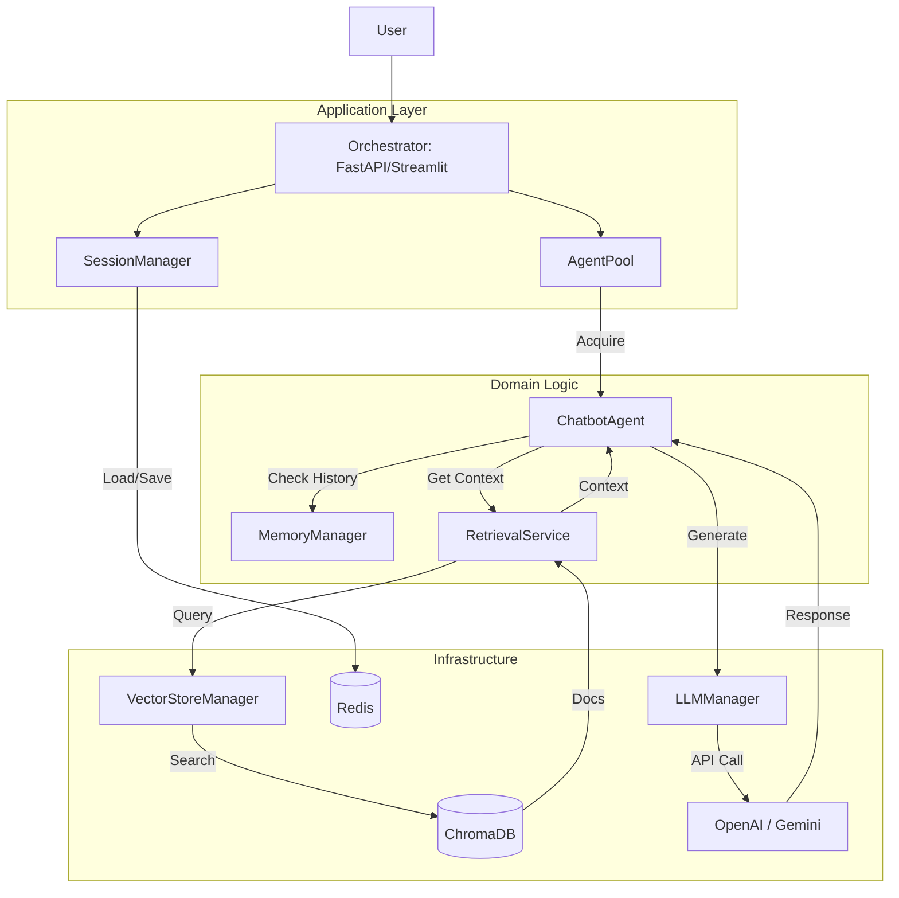

# Beyond the Hype: Building an Enterprise-Grade RAG Platform

*A deep dive into building scalable, enterprise-grade generic AI assistants.*

In the gold rush of Generative AI, building a "hello world" chatbot is easy. Building one that survives production traffic, manages memory efficiently, and handles real-world complexity is a different beast entirely. This post breaks down our approach to building a Production-Ready RAG (Retrieval-Augmented Generation) Chatbot system.

We've split this guide into four parts:
1.  **The Strategic Advantage**: Why this tech stack wins in the enterprise.
2.  **The RAG Architecture**: A technical deep dive into the retrieval pipeline.
3.  **Engineering the HR Chatbot**: The "Secret Sauce" of prompt engineering.
4.  **The Developer's Guide**: How to build and deploy your own bot.

---

## Part 1: The Strategic Advantage 🚀

### "Why isn't a simple script enough?"

Most RAG tutorials show you how to glue LangChain and OpenAI together in 50 lines of Python. That works for a prototype, but it fails in the enterprise because of resource bloat, vendor lock-in, and maintenance nightmares.

### Our Solution: The Enterprise RAG Engine

We built a platform, not just a chatbot. Here are the key differentiators:

#### 1. 🧩 Modular "Lego Block" Architecture
We don't build monoliths. We use **Clean Architecture** to ensure every component is independent and swappable.
*   **Plug-and-Play Components**: Want to switch from OpenAI to Anthropic? Just change a config. Want to swap ChromaDB for Pinecone? The business logic doesn't care.
*   **Future Proofing**: As new models and vector stores emerge, you can upgrade individual parts of the system without rewriting the core application.

#### 2. ⚖️ Built-in Quality Control (Evaluation)
We don't guess if the bot is working; we prove it.
*   **LLM-as-a-Judge**: We use advanced evaluation pipelines (integrated with LangSmith) where an automated "Judge" LLM scores every response for accuracy, relevance, and tone.
*   **Regression Testing**: Before deploying a new prompt or model, run our evaluation suite to ensure you haven't broken existing functionality.

#### 3. 💡 99% Memory Reduction with "Shared Agent Pools"
Instead of creating a new "Robot" for every single user, we use a **Shared Agent Pool**. Think of it like a call center: you don't hire a new support agent for every caller; you have a pool of agents who handle calls as they come in.
*   **Impact**: We can handle thousands of concurrent users with a fraction of the RAM.

#### 4. 🛡️ Robust & Flexible Tech Stack
*   **Core**: **Python** & **FastAPI** (Industry standard for high-performance AI backends).
*   **Orchestration**: **LangChain** & **LangGraph** (State-of-the-art flow control).
*   **Memory**: **Redis** (Persistent session management that survives crashes).
*   **Vector Store**: **ChromaDB** (Fast, local or server-based vector search).
*   **UI**: **Streamlit** (Rapid internal tooling and visualization).

---

## Part 2: The Architecture (Deep Dive) 🏗️

### The core of our system is a sophisticated Retrieval-Augmented Generation pipeline.

We designed the system using **Clean Architecture** to ensure separation of concerns. The diagram below maps the conceptual RAG flow directly to our codebase structure.



### Key Components mapped to Code

#### 1. The Application Layer (`src/application`)
*   **`AgentPool`**: Instead of instantiating a new heavy `HRChatbot` object for every request, this component manages a fixed pool of initialized agents. It handles the "check-out/check-in" lifecycle, drastically reducing overhead.

#### 2. The Domain Layer (`src/domain`)
This is where the business logic lives, independent of the database or UI.
*   **`ChatbotAgent`**: The base class for all bots. It defines the standard execution flow: `Retrieve -> Plan -> Generate`.
*   **`RetrievalService`**: It doesn't know *how* `ChromaDB` works; it just asks for "relevant documents". This abstraction allows us to swap vector stores later.

#### 3. The Infrastructure Layer (`src/infrastructure`)
*   **`VectorStoreManager`**: Handles the gritty details of embedding generation and ChromaDB connection.
*   **`LLMManager`**: A unified interface for all providers. Whether you use `gpt-4` or `gemini-1.5`, the domain layer just calls `llm.generate()`.

### The RAG Data Flow
1.  **Session Lookup**: `SessionManager` retrieves the conversation history from Redis.
2.  **Agent Allocation**: `AgentPool` provides a warm `ChatbotAgent`.
3.  **Retrieval**: `ChatbotAgent` calls `RetrievalService` -> `VectorStoreManager` -> `ChromaDB` to get relevant policy chunks.
4.  **Prompt Construction**: The agent combines the **System Prompt** (from config), **Conversation History**, and **Retrieved Config** into a single payload.
5.  **Generation**: `LLMManager` sends the payload to the external provider.
6.  **Teardown**: The response is saved to Redis, and the agent is scrubbed and returned to the pool.

---

## Part 3: Engineering the HR Chatbot 🤖

### The "Secret Sauce" is in the Prompt

Building an HR bot is high-stakes. A wrong answer about severance pay or leave policy can lead to legal issues. To handle this, we moved beyond basic instructions and engineered a "Rules-Based Personality" via our YAML configuration (`config/chatbot/prompts/hr_chatbot_prompts.yaml`).

### Key Prompt Engineering Techniques Used

#### 1. The "Refined Sniper" Rule
We strictly forbid the bot from being chatty.
> *"Provide the specific value, limit, or fact in the first sentence. You may provide additional details ONLY if they are directly relevant."*
This prevents the bot from burying the answer in three paragraphs of "HR speak."

#### 2. Strict Deduplication
LLMs love to repeat themselves if multiple retrieved documents look similar. We implemented a deduplication instruction:
> *"Before drafting, look at the 'source' of all retrieved snippets... Create a unique list schema... Assign [1] to the first unique file."*
This ensures the final "Sources" list is clean and usable.

#### 3. The "Stop Logic"
Hallucination prevention is critical.
> *"If the context does not contain the answer, state: 'The provided documents do not contain information regarding...' and STOP."*
We explicitly forcefully stop the model from trying to be helpful by guessing or using outside knowledge.

#### 4. Full-Cycle Audit
For "How-To" questions, we force a structured response format:
*   **Timelines**: When does it happen?
*   **Verification**: How is it approved?
*   **Consequences**: What happens if you miss it?

This structured approach transforms the chatbot from a "Search Engine" into a "Process Consultant."

---

## Part 4: The Developer's Guide 👩‍💻

### Under the Hood: Key Framework Primitives

We didn't just use these frameworks; we exploited their specific capabilities to build a robust system.

#### 1. LangChain & LangGraph
*   **`create_agent`**: We use this to compile our `System Prompt` + `Tools` (Retrieval) + `LLM` into a runnable agent.
*   **`RedisSaver`**: From `langgraph.checkpoint.redis`. This is critical. It allows us to save the entire state of the agent to Redis, meaning we can kill the server, restart it, and the bot remembers exactly where it left off.
*   **`RecursiveCharacterTextSplitter`**: Used in our ingestion pipeline. It respects code blocks and paragraphs, preventing us from splitting a sentence in half and confusing the LLM.

#### 2. FastAPI
*   **`APIRouter`**: We split our API into modular routes (`chat.py`, `users.py`) instead of one giant `main.py` file.
*   **`Depends`**: We use Dependency Injection for everything. Need the `SessionManager`? Inject it. Need the `AgentPool`? Inject it. This makes unit testing incredibly easy because we can inject "Mock" managers during tests.

#### 3. Streamlit
*   **`st.session_state`**: We rely on this to maintain the UI state (chat history, selected model) across re-runs of the script.
*   **`st.chat_message`**: A native widget that handles the avatars and formatting for user/assistant messages automatically.

---

### ⚡ Quick Start with Docker

The easiest way to stand up the entire stack (App + Redis) is Docker.

```bash
# 1. Clone & Config
cp .env-sample .env  # Add your OPENAI_API_KEY

# 2. Launch
docker-compose up --build
```
*   **FastAPI**: `http://localhost:8000/docs`
*   **Streamlit UI**: `http://localhost:8501`

### 🛠️ Creating Your Own Chatbot (The 4-Step Recipe)

Want to build a specialized "Legal Bot" or "Sales Assistant"? You don't need to touch the core engine. Just follow this recipe:

#### Step 1: The Config (`config/chatbot/legal_config.yaml`)
Define the personality and resources.
```yaml
model:
  name: "gpt-4"
vector_store:
  type: "legal"
  collection_name: "legal_docs"
agent_pool:
  size: 2
```

#### Step 2: The Prompts (`config/chatbot/prompts/legal_prompts.yaml`)
Tell it who it is.
```yaml
system_prompt: |
  You are a Legal Assistant. 
  Only answer based on the retrieved Production Service Agreements.
  If unsure, say "I need to consult a human lawyer."
```

#### Step 3: The Class (`src/domain/chatbot/legal_chatbot.py`)
Minimal boilerplate to wire it up.
```python
class LegalChatbot(ChatbotAgent):
    def _get_chatbot_type(self): return "legal"
    def _get_config_filename(self): return "legal_config.yaml"
```

#### Step 4: The Data
Ingest your PDF/Docs into the vector store.
```bash
python scripts/ingestion/create_vectorstore.py \
  --chatbot-type legal \
  --folder-path ./my_legal_pdfs/
```

### Conclusion
This project moves beyond the "tutorial" phase into a scalable, maintainable architecture. whether you are a startup needing a cost-effective support bot or an enterprise building a fleet of internal tools, this RAG engine provides the solid foundation you need.

[Link to Repository]
