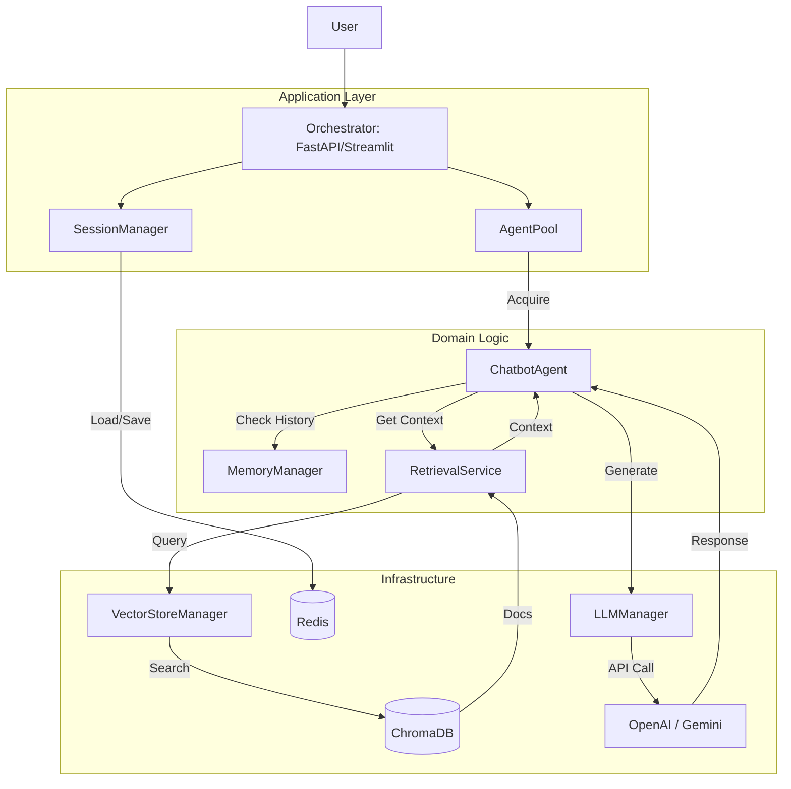

# Beyond the Hype: Building an Enterprise-Grade RAG Platform

*A deep dive into building scalable, enterprise-grade generic AI assistants.*

In the gold rush of Generative AI, building a "hello world" chatbot is easy. Building one that survives production traffic, manages memory efficiently, and handles real-world complexity is a different beast entirely. This post breaks down our approach to building a Production-Ready RAG (Retrieval-Augmented Generation) Chatbot system.

We've split this guide into four parts:
1.  **The Strategic Advantage**: Why this tech stack wins in the enterprise.
2.  **The RAG Architecture**: A technical deep dive into the retrieval pipeline.
3.  **Engineering the HR Chatbot**: The "Secret Sauce" of prompt engineering.
4.  **The Developer's Guide**: How to build and deploy your own bot.

---

## Part 1: The Strategic Advantage 🚀

### "Why isn't a simple script enough?"

Most RAG tutorials show you how to glue LangChain and OpenAI together in 50 lines of Python. That works for a prototype, but it fails in the enterprise because of resource bloat, vendor lock-in, and maintenance nightmares.

### Our Solution: The Enterprise RAG Engine

We built a platform, not just a chatbot. Here are the key differentiators:

#### 1. 🧩 Modular "Lego Block" Architecture
We don't build monoliths. We use **Clean Architecture** to ensure every component is independent and swappable.
*   **Plug-and-Play Components**: Want to switch from OpenAI to Anthropic? Just change a config. Want to swap ChromaDB for Pinecone? The business logic doesn't care.
*   **Future Proofing**: As new models and vector stores emerge, you can upgrade individual parts of the system without rewriting the core application.

#### 2. ⚖️ Built-in Quality Control (Evaluation)
We don't guess if the bot is working; we prove it.
*   **LLM-as-a-Judge**: We use advanced evaluation pipelines (integrated with LangSmith) where an automated "Judge" LLM scores every response for accuracy, relevance, and tone.
*   **Regression Testing**: Before deploying a new prompt or model, run our evaluation suite to ensure you haven't broken existing functionality.

#### 3. 💡 99% Memory Reduction with "Shared Agent Pools"
Instead of creating a new "Robot" for every single user, we use a **Shared Agent Pool**. Think of it like a call center: you don't hire a new support agent for every caller; you have a pool of agents who handle calls as they come in.
*   **Impact**: We can handle thousands of concurrent users with a fraction of the RAM.

#### 4. 🛡️ Robust & Flexible Tech Stack
*   **Core**: **Python** & **FastAPI** (Industry standard for high-performance AI backends).
*   **Orchestration**: **LangChain** & **LangGraph** (State-of-the-art flow control).
*   **Memory**: **Redis** (Persistent session management that survives crashes).
*   **Vector Store**: **ChromaDB** (Fast, local or server-based vector search).
*   **UI**: **Streamlit** (Rapid internal tooling and visualization).

---

## Part 2: The Architecture (Deep Dive) 🏗️

### The core of our system is a sophisticated Retrieval-Augmented Generation pipeline.

We designed the system using **Clean Architecture** to ensure separation of concerns. The diagram below maps the conceptual RAG flow directly to our codebase structure.



### Key Components mapped to Code

#### 1. The Application Layer (`src/application`)
*   **`AgentPool`**: Instead of instantiating a new heavy `HRChatbot` object for every request, this component manages a fixed pool of initialized agents. It handles the "check-out/check-in" lifecycle, drastically reducing overhead.

#### 2. The Domain Layer (`src/domain`)
This is where the business logic lives, independent of the database or UI.
*   **`ChatbotAgent`**: The base class for all bots. It defines the standard execution flow: `Retrieve -> Plan -> Generate`.
*   **`RetrievalService`**: It doesn't know *how* `ChromaDB` works; it just asks for "relevant documents". This abstraction allows us to swap vector stores later.

#### 3. The Infrastructure Layer (`src/infrastructure`)
*   **`VectorStoreManager`**: Handles the gritty details of embedding generation and ChromaDB connection.
*   **`LLMManager`**: A unified interface for all providers. Whether you use `gpt-4` or `gemini-1.5`, the domain layer just calls `llm.generate()`.

### The RAG Data Flow
1.  **Session Lookup**: `SessionManager` retrieves the conversation history from Redis.
2.  **Agent Allocation**: `AgentPool` provides a warm `ChatbotAgent`.
3.  **Retrieval**: `ChatbotAgent` calls `RetrievalService` -> `VectorStoreManager` -> `ChromaDB` to get relevant policy chunks.
4.  **Prompt Construction**: The agent combines the **System Prompt** (from config), **Conversation History**, and **Retrieved Config** into a single payload.
5.  **Generation**: `LLMManager` sends the payload to the external provider.
6.  **Teardown**: The response is saved to Redis, and the agent is scrubbed and returned to the pool.

---

## Part 3: Engineering the HR Chatbot 🤖

### The "Secret Sauce" is in the Prompt

Building an HR bot is high-stakes. A wrong answer about severance pay or leave policy can lead to legal issues. To handle this, we moved beyond basic instructions and engineered a "Rules-Based Personality" via our YAML configuration (`config/chatbot/prompts/hr_chatbot_prompts.yaml`).

### Key Prompt Engineering Techniques Used

#### 1. The "Refined Sniper" Rule
We strictly forbid the bot from being chatty.
> *"Provide the specific value, limit, or fact in the first sentence. You may provide additional details ONLY if they are directly relevant."*
This prevents the bot from burying the answer in three paragraphs of "HR speak."

#### 2. Strict Deduplication
LLMs love to repeat themselves if multiple retrieved documents look similar. We implemented a deduplication instruction:
> *"Before drafting, look at the 'source' of all retrieved snippets... Create a unique list schema... Assign [1] to the first unique file."*
This ensures the final "Sources" list is clean and usable.

#### 3. The "Stop Logic"
Hallucination prevention is critical.
> *"If the context does not contain the answer, state: 'The provided documents do not contain information regarding...' and STOP."*
We explicitly forcefully stop the model from trying to be helpful by guessing or using outside knowledge.

#### 4. Full-Cycle Audit
For "How-To" questions, we force a structured response format:
*   **Timelines**: When does it happen?
*   **Verification**: How is it approved?
*   **Consequences**: What happens if you miss it?

This structured approach transforms the chatbot from a "Search Engine" into a "Process Consultant."

---

## Part 4: The Developer's Guide 👩‍💻

**Goal**: Build your own production-ready RAG chatbot using our modular architecture. This guide walks you through the implementation with real code snippets from our codebase.

---

### Architecture Overview

The system has 5 major components:

1. **Document Ingestion & Vector Store Creation** - Load PDFs, split into chunks, generate embeddings, store in ChromaDB
2. **Agent Pool Management** - Reuse chatbot instances across requests to reduce memory overhead
3. **Retrieval-Augmented Generation** - Query vector store, retrieve context, generate responses
4. **Session & Memory Management** - Maintain conversation history using Redis checkpointer
5. **API & UI Layer** - FastAPI endpoints and Streamlit interface for user interaction

---

### Component Breakdown with Code Snippets

#### 1. Create Vector Database from Documents

The first step is ingesting your documents into a vector store. Our ingestion pipeline loads PDFs, splits them into chunks with overlap, generates embeddings, and stores them in ChromaDB.

```python
from src.application.ingestion.loader import load_pdf_documents
from src.application.ingestion.chunker import split_documents
from langchain_community.vectorstores import Chroma
from src.infrastructure.vectorstore.manager import create_embeddings

# Load PDF documents from folder
documents = load_pdf_documents(folder_path="./policies", recursive=True)

# Split into chunks (1000 chars per chunk, 200 overlap)
split_docs = split_documents(
    documents,
    chunk_size=1000,
    chunk_overlap=200,
    add_start_index=True
)

# Create embeddings (supports OpenAI, Google, etc.)
embeddings = create_embeddings(
    provider="openai",
    embedding_model="text-embedding-3-small"
)

# Store in ChromaDB
vector_store = Chroma.from_documents(
    documents=split_docs,
    embedding=embeddings,
    persist_directory="./data/vectorstores/chroma_db/hr_chatbot"
)
```

**CLI Usage:**
```bash
python scripts/ingestion/create_vectorstore.py \
  --chatbot-type hr \
  --folder ./policies \
  --chunk-size 1000 \
  --chunk-overlap 200
```

---

#### 2. Agent Pool: Memory-Efficient Agent Management

Instead of creating a new chatbot instance for every request (which would consume massive memory), we use an **Agent Pool** that reuses pre-initialized agents. This reduces memory usage by 99% for concurrent users.

```python
from src.application.chatbot.agent_pool import AgentPool, get_agent_pool
from src.domain.chatbot.hr_chatbot import HRChatbot

# Create agent pool (singleton pattern per chatbot type)
agent_pool = get_agent_pool(
    chatbot_type="hr",
    agent_factory=HRChatbot._get_default_instance,
    pool_size=1  # Single shared agent (most common)
)

# Get agent from pool (thread-safe)
chatbot = agent_pool.get_agent()

# Use the agent
response = chatbot.chat(
    query="What is the vacation policy?",
    thread_id="user-123-session-456"
)

# Agent is automatically returned to pool after use
```

**Key Benefits:**
- **Memory Efficiency**: One agent instance serves thousands of users
- **Thread-Safe**: Round-robin allocation for concurrent requests
- **Hot Start**: Agents are pre-initialized, eliminating cold-start latency

---

#### 3. Retrieval-Augmented Generation Pipeline

The core RAG flow: retrieve relevant documents, inject context into prompt, generate response.

```python
from src.domain.retrieval.service import RetrievalService
from langchain.agents import create_agent
from src.infrastructure.llm.manager import get_llm_manager

# Initialize retrieval service with vector store
vector_store = get_vector_store("hr")
retrieval_service = RetrievalService(vector_store)

# Create retrieval tool for the agent
retrieve_tool = retrieval_service.create_tool()

# Get LLM instance
llm = get_llm_manager().get_llm(
    model_name="gemini-2.5-flash",
    temperature=0.7
)

# Create agent with retrieval tool
agent = create_agent(
    model=llm,
    tools=[retrieve_tool],
    system_prompt=system_prompt
)

# Agent automatically uses retrieval tool when needed
response = agent.invoke({
    "messages": [("user", "What is the maternity leave policy?")]
})
```

**How It Works:**
1. User asks: "What is the maternity leave policy?"
2. Agent calls `retrieve_documents` tool with query
3. Vector store returns top 4 relevant document chunks
4. Agent combines context + system prompt + user question
5. LLM generates response based on retrieved context

---

#### 4. Session & Memory Management with Redis

We use **LangGraph's Redis checkpointer** to persist conversation state. This means the bot remembers context across server restarts.

```python
from langgraph.checkpoint.redis import RedisSaver
from src.infrastructure.storage.checkpointing.manager import get_checkpointer

# Redis checkpointer (configured automatically)
checkpointer = get_checkpointer()

# Create agent with checkpointer
agent = create_agent(
    model=llm,
    tools=[retrieve_tool],
    checkpointer=checkpointer  # Enables state persistence
)

# Chat with thread_id (session identifier)
config = {"configurable": {"thread_id": "user-123-session-456"}}
response = agent.invoke(
    {"messages": [("user", "What is the vacation policy?")]},
    config=config
)

# Later, in a different request...
# Agent automatically loads conversation history from Redis
response2 = agent.invoke(
    {"messages": [("user", "How many days?")]},  # References previous question
    config=config  # Same thread_id = same conversation
)
```

**Memory Strategies:**
Our system supports multiple memory strategies configured via YAML:

```yaml
memory:
  strategy: "trim"  # Options: "none", "trim", "summarize", "trim_and_summarize"
  trim_keep_messages: 1  # Keep last N messages when trimming
  summarize_threshold: 2  # Summarize when messages exceed this count
```

---

#### 5. FastAPI Endpoints with Dependency Injection

Our API uses FastAPI's dependency injection for clean, testable code. Session management is handled automatically via headers.

```python
from fastapi import APIRouter, Depends
from src.domain.chatbot.hr_chatbot import get_hr_chatbot
from src.shared.dependencies.session import get_session_from_headers

router = APIRouter()

@router.post("/", response_model=ChatResponse)
async def chat_with_hr_chatbot(
    request: ChatRequest,
    session: ChatbotSession = Depends(get_session_from_headers)
):
    """
    Chat endpoint with automatic session management.
    Session ID is extracted from X-Session-ID header or session_id cookie.
    """
    # Get agent from pool (thread-safe)
    chatbot = get_hr_chatbot()
    
    # Chat with automatic memory management
    response_text = chatbot.chat(
        query=request.message,
        thread_id=session.session_id,  # Used for Redis checkpointer
        user_id=session.user_id
    )
    
    return ChatResponse(
        response=response_text,
        session_id=session.session_id,
        model_used=chatbot.model_name
    )
```

**Session Management:**
- **Headers**: `X-Session-ID`, `X-User-ID` (preferred)
- **Cookies**: `session_id`, `user_id` (fallback)
- **Auto-Generation**: New session created if not provided

---

#### 6. Streamlit UI for Interactive Testing

Our Streamlit interface provides a chat UI for testing and demos.

```python
import streamlit as st
from src.domain.chatbot.hr_chatbot import get_hr_chatbot

st.title("HR Chatbot")

# Initialize session state
if "messages" not in st.session_state:
    st.session_state.messages = []
if "session_id" not in st.session_state:
    st.session_state.session_id = str(uuid.uuid4())

# Display chat history
for msg in st.session_state.messages:
    with st.chat_message(msg["role"]):
        st.markdown(msg["content"])

# User input
if prompt := st.chat_input("Ask about HR policies..."):
    # Add user message
    st.session_state.messages.append({"role": "user", "content": prompt})
    
    # Get chatbot and generate response
    chatbot = get_hr_chatbot()
    response = chatbot.chat(
        query=prompt,
        thread_id=st.session_state.session_id
    )
    
    # Add assistant response
    st.session_state.messages.append({"role": "assistant", "content": response})
```

---

### ⚡ Quick Start with Docker

The easiest way to stand up the entire stack (App + Redis) is Docker.

```bash
# 1. Clone & Configure
git clone <repository>
cd rag_chatbot
cp .env-sample .env  # Add your OPENAI_API_KEY or GEMINI_API_KEY

# 2. Launch Services
docker-compose up --build
```

**Access Points:**
- **FastAPI**: `http://localhost:8000/docs`
- **Streamlit UI**: `http://localhost:8501`
- **Redis**: `localhost:6379` (for checkpointer)

---

### 🛠️ Creating Your Own Chatbot (The 4-Step Recipe)

Want to build a specialized "Legal Bot" or "Sales Assistant"? You don't need to touch the core engine. Just follow this recipe:

#### Step 1: The Config (`config/chatbot/legal_chatbot_config.yaml`)

Define the personality, model, and resources.

```yaml
model:
  name: "gpt-4"
  temperature: 0.7
  max_tokens: 2000

vector_store:
  type: "legal"
  persist_dir: "./data/vectorstores/chroma_db/legal_chatbot"
  collection_name: "legal_docs"
  embedding_provider: "openai"
  embedding_model: "text-embedding-3-small"

tools:
  enable_retrieval: true

memory:
  strategy: "trim"
  trim_keep_messages: 5

agent_pool:
  size: 2
```

#### Step 2: The Prompts (`config/chatbot/prompts/legal_prompts.yaml`)

Tell it who it is and how to behave.

```yaml
system_prompt: |
  You are a Legal Assistant specializing in contract analysis.
  Only answer based on the retrieved legal documents.
  If the information is not in the provided context, state:
  "The provided documents do not contain information regarding [topic]."
  Do NOT guess or use outside knowledge.

agent_instructions: |
  - Provide specific clause numbers and page references
  - Quote exact text from documents when possible
  - If unsure, recommend consulting a human lawyer
```

#### Step 3: The Class (`src/domain/chatbot/legal_chatbot.py`)

Minimal boilerplate - just define the type and config filename.

```python
from src.domain.chatbot.core.chatbot_agent import ChatbotAgent

class LegalChatbot(ChatbotAgent):
    """Legal chatbot implementation."""
    
    def _get_chatbot_type(self) -> str:
        return "legal"
    
    @classmethod
    def _get_config_filename(cls) -> str:
        return "legal_chatbot_config.yaml"
    
    @classmethod
    def _get_default_instance(cls) -> "LegalChatbot":
        return LegalChatbot()

# Convenience function
def get_legal_chatbot() -> LegalChatbot:
    return LegalChatbot.get_from_pool()
```

**That's it!** The base `ChatbotAgent` class automatically:
- Loads YAML configuration
- Creates retrieval tools
- Builds system prompts
- Manages memory
- Handles agent pool

#### Step 4: Ingest Your Data

Load your PDFs/Documents into the vector store.

```bash
python scripts/ingestion/create_vectorstore.py \
  --chatbot-type legal \
  --folder ./legal_documents \
  --chunk-size 1000 \
  --chunk-overlap 200
```

**Verify the vector store:**
```python
from src.infrastructure.vectorstore.manager import get_vector_store

vector_store = get_vector_store("legal")
count = vector_store._collection.count()
print(f"Vector store contains {count} document chunks")
```

---

### Best Practices & Production Considerations

1. **Embedding Provider Selection**
   - **OpenAI**: Best quality, higher cost (`text-embedding-3-small`)
   - **Google**: Good balance (`text-embedding-ada-002` equivalent)
   - **Local Models**: Cost-effective for high-volume (requires GPU)

2. **Chunk Size Tuning**
   - **Small chunks (500-800)**: Better precision, more chunks to retrieve
   - **Large chunks (1500-2000)**: More context, but may include irrelevant info
   - **Sweet spot**: 1000-1200 characters with 200 overlap

3. **Memory Strategy Selection**
   - **`trim`**: Fast, keeps last N messages (good for short conversations)
   - **`summarize`**: Compresses history, maintains long-term context
   - **`trim_and_summarize`**: Best of both worlds (recommended for production)

4. **Agent Pool Sizing**
   - **Size 1**: Single shared agent (99% of use cases)
   - **Size 2-4**: For high concurrency (1000+ concurrent users)
   - **Monitor**: Use `get_all_pool_stats()` to track pool utilization

5. **Evaluation Before Deployment**
   ```bash
   python evaluations/hr_chatbot/evaluate_hr_chatbot.py \
     --dataset sample_dataset.json \
     --output results.json
   ```
   Our evaluation pipeline uses LLM-as-a-Judge to score responses for accuracy, relevance, and tone.

---

### Conclusion

This project moves beyond the "tutorial" phase into a scalable, maintainable architecture. Whether you're a startup needing a cost-effective support bot or an enterprise building a fleet of internal tools, this RAG engine provides the solid foundation you need.

**Key Takeaways:**
- **Modular Architecture**: Swap components (LLM, vector store, embeddings) without rewriting core logic
- **Memory Efficient**: Agent pools reduce memory by 99% vs. per-request instantiation
- **Production Ready**: Redis checkpointer, session management, evaluation pipelines
- **Developer Friendly**: 4-step recipe to create new chatbots without touching core code

[Link to Repository]
